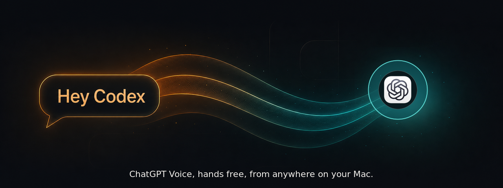

<div align="center">



# Hey Codex

**Say "Hey Codex." ChatGPT Voice opens. Keep your hands where they are.**

[](https://github.com/cyburke/hey-codex/releases/latest)
[](https://github.com/cyburke/hey-codex/releases/latest)
[](LICENSE)
[](https://github.com/cyburke/hey-codex/releases/latest)

</div>

---

OpenAI shipped Voice mode in the ChatGPT desktop app. It is genuinely good, and it opens with a keyboard shortcut.

Hey Codex removes the keyboard. It sits in your menu bar, listens for a wake phrase, and presses that same shortcut for you. That is the entire tool.

Nothing is recorded. Nothing is uploaded. No account, no signup, no config file.

## Install

**Homebrew, recommended**

```bash
brew install --cask cyburke/tap/hey-codex
```

That is the whole install. Open it from Applications and it launches straight away.

**Or download it**

1. Grab the `.zip` from the [latest release](https://github.com/cyburke/hey-codex/releases/latest). It is 18 MB.
2. Unzip and drag **HeyCodex.app** into Applications.
3. Run this once, which takes about two seconds:

```bash
xattr -dr com.apple.quarantine /Applications/HeyCodex.app
```

4. Open it.

If you would rather not touch a terminal, skip step 3, open the app, click **Done** on the warning, then go to **System Settings → Privacy & Security**, scroll to Security, and click **Open Anyway**. Same result.

Both routes exist because Hey Codex is not notarized by Apple. [Here is why that is, and what it does and does not mean.](#why-macos-warns-you)

## Set it up

Setup happens in the menu bar. There are no windows and nothing to hunt for: the menu bar item tells you what is left to do, and stops asking once it is done.

First, in **ChatGPT → Settings → Voice**, check the **Voice chat hotkey**. Hey Codex expects `⌃⌥V`. Any chord works as long as both apps agree.

Then launch Hey Codex and follow the menu bar:

| It says | You do |
| --- | --- |
| **Set up Hey Codex: step 1 of 2** | Click it, allow **Microphone**. This is how it hears you. |
| **Set up Hey Codex: step 2 of 2** | Click it, allow **Accessibility**. This is how it presses the hotkey. |
| **Finishing setup...** | Nothing. It restarts itself so macOS hands it the new permission. |
| **Ready: click to test** | Click **Try It: Test ChatGPT Voice**. Confirms your hotkey matches. |
| **All set. Say "Hey Codex" anytime** | Say it. |

Orange means something is still waiting on you. Green means it just finished. A plain icon means it is listening and out of your way.

To end a Voice session, close it in ChatGPT however you normally would. Hey Codex notices and starts listening again by itself. There is no second phrase to memorize.

## What makes it not annoying

Most wake-word tools get one thing wrong: they fire the shortcut and assume it worked. Since the ChatGPT hotkey is a toggle, that means saying your phrase while Voice is already open hangs up on you.

Hey Codex checks whether ChatGPT's Voice panel is actually on screen before it does anything.

| Situation | What happens |
| --- | --- |
| You say the phrase | Voice opens |
| You say it again while Voice is open | Nothing. It will not hang up on you |
| You opened Voice with the keyboard yourself | It knows, and stays quiet |
| Voice ends, any way at all | It starts listening again on its own |
| ChatGPT is the frontmost app | Still works |

While a Voice session is open it stops listening entirely, so your conversation cannot set it off.

## Use your own wake phrase

"Hey Codex" is the default. For anything else, pick **Use My Own Wake Phrase** from the menu, type a phrase, and say it three times.

Those recordings never leave your Mac. They exist to build the keyword from how the speech model hears *your* voice, then the detector is tuned until all three of your takes fire. That is why it beats picking from a list. A keyword guessed from spelling matches a generic speaker, not you.

Longer phrases are better. Single words go off by accident. Switching back to "Hey Codex" is one button.

## Privacy

Wake-word detection runs on your Mac with a bundled offline model. No audio, no transcripts, no wake events, ever, to anyone. No analytics. No telemetry.

There is exactly one network request in the whole app: once a day it asks GitHub whether a newer release exists. It sends nothing about you, and you can switch it off in Settings, at which point Hey Codex makes no network requests at all.

Two permissions, both doing the obvious thing:

- **Microphone**, to hear the phrase.
- **Accessibility**, to press the hotkey.

Revoke either in System Settings whenever you like.

## Why macOS warns you

Hey Codex is not notarized. Notarization requires a paid Apple Developer account, and this is free software.

Gatekeeper reads "not notarized" as "unknown," so macOS quarantines the download. That is a statement about Apple's paperwork, not about the app. Every line of source is in this repo, and you can build it yourself in about a minute if you would rather not take my word for it.

The Homebrew cask clears that quarantine flag for you during install, which is why it launches without a prompt. If you would rather macOS keep its guard up and approve the app yourself, install from the zip and use the System Settings route instead.

If you hold an Apple Developer ID and want to contribute a notarized build, please open an issue. That would be a genuinely useful contribution.

## Why not just use macOS Voice Control?

You can. Voice Control has custom commands, and one of the available actions is [pressing a keyboard shortcut](https://support.apple.com/guide/mac-help/customize-voice-control-mchl9899c8a5/mac), so a spoken phrase really can trigger ChatGPT Voice with nothing installed.

The catch is what else comes along. Voice Control is a system-wide accessibility layer: switch it on and it listens for every command it knows, everywhere, and dictates unmatched speech into whatever field has focus. If you already use a dictation tool, the two compete for the same words. There is a sleep command to park it, but you will be using it constantly.

Hey Codex listens for one phrase and does one thing. It never inserts text, never interprets anything else you say, and needs nothing switched on system-wide.

## Known limits

- Updates are not automatic. Hey Codex tells you when a release exists, you install it.
- The app is signed but not notarized. Homebrew handles that for you. A downloaded zip needs the one line above, or a trip through System Settings.
- Upgrading can re-prompt for Microphone and Accessibility, because a rebuilt app can look like a new app to macOS.
- It is a wake-word tool, so it will occasionally miss you or trip on something that sounds close. Sensitivity is adjustable.

## Build it yourself

Needs macOS 14.4 or later and Swift 6.

```bash
git clone https://github.com/cyburke/hey-codex.git
cd hey-codex
./scripts/fetch-sherpa.sh
./scripts/fetch-models.sh
swift test
./scripts/build-release.sh
```

The bundle lands in `dist/HeyCodex.app`.

## Something broken?

[Open an issue.](https://github.com/cyburke/hey-codex/issues/new/choose) The template asks for the handful of details that make a report actionable. Please skip recordings and transcripts unless you are happy for them to be public.

## Credit

Hey Codex is a GPL-3.0 fork of **[littlemelon77/hey-claude](https://github.com/littlemelon77/hey-claude)**. The wake-word listener and audio capture pipeline are that project's work, and this would not exist without it. Hey Codex rebuilds the activation logic and interface around ChatGPT Voice.

Wake-word detection uses [sherpa-onnx](https://github.com/k2-fsa/sherpa-onnx) by Xiaomi Corporation.

Licensed under [GPL-3.0](LICENSE). Full attribution in [NOTICE](NOTICE). Not affiliated with OpenAI.
